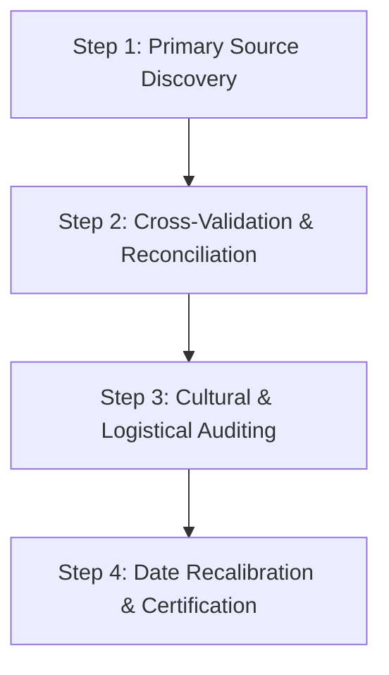

# VIRASAT Festival Data Verification Guide & Audit Protocol

## 1. Quality & Authenticity Charter
The VIRASAT cultural intelligence framework strictly adheres to zero-hallucination protocols. Under no circumstances are dummy records, invented descriptions, or arbitrary dates permitted in production databases. Every festival entry must be authenticated against verified, authoritative primary sources.

---

## 2. Institutional Verification Hierarchy

| Tier | Source Category | Primary Authorities & Portals | Verification Focus |
| :--- | :--- | :--- | :--- |
| **Tier 1** | Central Government & National Bodies | • Ministry of Tourism, Govt of India (`incredibleindia.gov.in`) • Archaeological Survey of India (`asi.nic.in`) • Sangeet Natak Akademi (`sangeetnatak.gov.in`) • Ministry of Culture, Government of India | Official national status, protected heritage sites, national cultural carnivals |
| **Tier 2** | State Tourism Corporations & Gazettes | • 28 State Tourism Boards (e.g., RTDC, Gujarat Tourism, KSTDC, MP Tourism, Assam Tourism) • 8 UT Tourism Directorates • Official State Gazetted Holiday Lists | Authentic regional dates, festival venue logistics, local travel regulations |
| **Tier 3** | Statutory Religious & Temple Boards | • Tirumala Tirupati Devasthanams (TTD) • Shree Jagannatha Temple Administration, Puri • Travancore Devaswom Board, Sabarimala • Shiromani Gurdwara Parbandhak Committee (SGPC) • Kamakhya Devalaya Management Board • Bodh Gaya Temple Management Committee | Authentic ritual procedures, Mahaprasadam items, deity alankaram rules, sacred timings |
| **Tier 4** | Astronomical & Ephemeris Authorities | • Rashtriya Panchang (Positional Astronomy Centre, IMD, Kolkata) • Indian Ephemeris and Nautical Almanac • Classical regional calendars (Drik Panchang, Tamil Vakya/Thirukanitha) | Exact astronomical solar and lunar Tithis for current and subsequent calendar years |

---

## 3. Four-Step Verification Protocol

### Step 1: Primary Source Discovery
- Confirm existence via official state tourism archives, gazetteers, or statutory temple board publications.
- Flag any festival lacking multi-party historical documentation for secondary academic review.

### Step 2: Cross-Validation & Reconciliation
- Cross-reference local names, language variants, and cultural associations across indigenous community records and academic anthropological publications.
- Verify geographical coordinates, venue grounds, and regional administrative boundaries.

### Step 3: Cultural & Logistical Auditing
- Verify authentic gastronomy: ensure listed food items are historically accurate to the festival (e.g., *Purang Apin* for Ali-Ai-Ligang, *Ukadiche Modak* for Ganesh Chaturthi, *Sheer Khurma* for Eid-ul-Fitr).
- Validate visitor guidelines, etiquette, dress codes, accessibility constraints, and crowd safety ratings.

### Step 4: Date Recalibration & Certification
- Compute exact dates for the operational year (2026) and subsequent year (2027) using the classified `date_type` algorithm.
- Tag verified records with `data_confidence_status = "VERIFIED_OFFICIAL"`.

---

## 4. Maintenance & Annual Audit Cycle
- **Quarterly Spot Checks**: Review upcoming quarterly festivals against state tourism announcements for organizer-announced dates.
- **Annual Astronomical Realignment**: Run the automated date recalculation engine against the annual Rashtriya Panchang release for subsequent year lunar alignments.
- **Community Feedback Ingestion**: Qualified cultural researchers and verified local guides can submit date or venue amendments subject to peer review.
