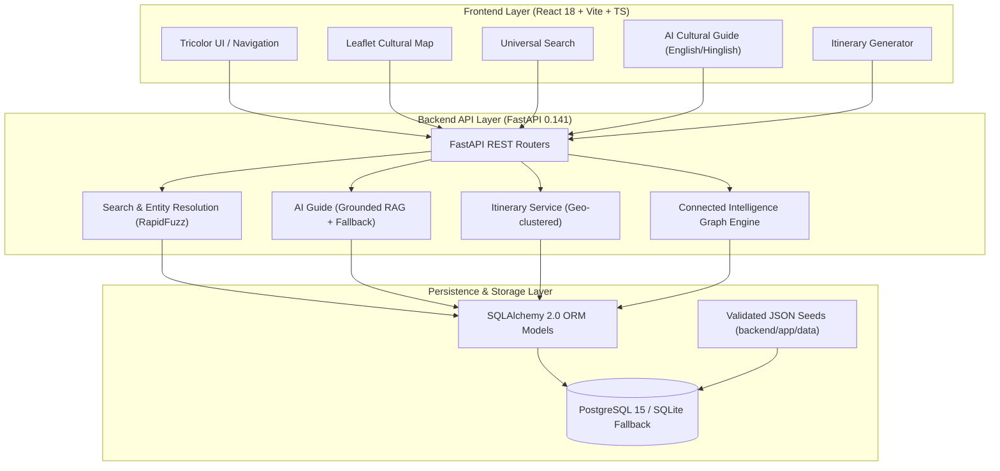

# VIRASAT — System Architecture Specification

## 1. System Overview

VIRASAT is a unified cultural-intelligence and heritage discovery platform engineered for the Smart India Hackathon (SIH 2026). It connects India's monuments, archaeological sites, vibrant festivals, traditional handicrafts, performing arts, and curated cultural experiences into a single verified, relational database.

## 2. Component Design

### 2.1 Backend Layer (Python / FastAPI)
- **FastAPI Core:** Async request handling, Pydantic v2 strict input/output validation, dependency injection for database sessions.
- **Relational Database Engine:** SQLAlchemy 2.0 supporting PostgreSQL 15+ (production with PostGIS if available) and SQLite (local zero-dependency fallback).
- **Universal Search & Entity Resolution:** Normalization (lowercase, diacritics stripping), alias lookup, and RapidFuzz token-sort similarity scoring to eliminate hallucinations and irrelevant token matches.
- **Connected Cultural Intelligence Engine:** Bidirectional graph traversals linking monuments to regional festivals, living traditions, indigenous crafts, artisan clusters, and authentic experiences.
- **AI Cultural Guide:** Strict Grounded RAG architecture ensuring answers originate purely from verified database records. When records are missing, the assistant returns an exact non-hallucination notice.

### 2.2 Frontend Layer (React 18 / TypeScript / Vite / Tailwind)
- **Design Tokens:** Strict Indian Tricolor palette (`saffron`, `indiaGreen`, `ivory`, `charcoal`) defined in `tailwind.config.js`. Zero extraneous blue or purple accent hues in core components.
- **Global Navigation:** 9 primary exploration tabs + right-hand utility cluster (`Search`, `Ask VIRASAT AI`, `About`) conforming strictly to Grandmaster v2.0 Section 5.1.
- **Interactive Geospatial Map:** Leaflet map with category-coded pins (saffron for monuments, green for festivals, neutral for crafts, outline for experiences), full detail popups, and radius-based nearby discoveries.
- **Verified Badging:** Unified `<VerifiedBadge />` component representing `VERIFIED`, `PARTIALLY_VERIFIED`, and `UNVERIFIED` statuses backed by citable sources.
