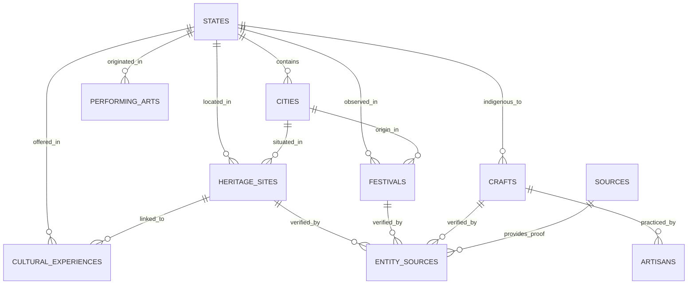

# VIRASAT — Relational Database Schema Specification

## 1. Schema Diagram & Relationships

The VIRASAT database is structured as a normalized relational schema with explicit foreign keys, unique slugs, geospatial coordinates, and source provenance tracking.



## 2. Table Definitions

### 2.1 Geographic Hierarchy
```sql
CREATE TABLE states (
    id VARCHAR(64) PRIMARY KEY,
    name VARCHAR(128) NOT NULL,
    state_code VARCHAR(16),
    region VARCHAR(64) NOT NULL,
    capital VARCHAR(128),
    created_at TIMESTAMP DEFAULT CURRENT_TIMESTAMP,
    updated_at TIMESTAMP DEFAULT CURRENT_TIMESTAMP
);

CREATE TABLE cities (
    id VARCHAR(64) PRIMARY KEY,
    state_id VARCHAR(64) REFERENCES states(id) ON DELETE CASCADE,
    name VARCHAR(128) NOT NULL,
    district VARCHAR(128),
    latitude FLOAT NOT NULL,
    longitude FLOAT NOT NULL,
    description TEXT
);
```

### 2.2 Cultural Entities
```sql
CREATE TYPE verification_status_enum AS ENUM ('VERIFIED', 'PARTIALLY_VERIFIED', 'UNVERIFIED', 'NEEDS_REVIEW');
CREATE TYPE date_type_enum AS ENUM ('FIXED', 'LUNAR', 'ANNUAL_OFFICIAL', 'APPROX_SEASONAL');
CREATE TYPE gi_status_enum AS ENUM ('REGISTERED', 'APPLIED', 'NOT_REGISTERED', 'UNKNOWN');
CREATE TYPE exp_type_enum AS ENUM ('INFORMATIONAL', 'BOOKABLE');

CREATE TABLE heritage_sites (
    id VARCHAR(64) PRIMARY KEY,
    name VARCHAR(255) NOT NULL,
    slug VARCHAR(255) UNIQUE NOT NULL,
    city_id VARCHAR(64) REFERENCES cities(id),
    state_id VARCHAR(64) REFERENCES states(id),
    category VARCHAR(64) NOT NULL,
    architectural_style VARCHAR(128),
    historical_period VARCHAR(128),
    construction_period VARCHAR(128),
    historical_description TEXT NOT NULL,
    cultural_significance TEXT NOT NULL,
    latitude FLOAT NOT NULL,
    longitude FLOAT NOT NULL,
    image_url TEXT,
    image_attribution VARCHAR(255),
    verification_status verification_status_enum DEFAULT 'NEEDS_REVIEW',
    created_at TIMESTAMP DEFAULT CURRENT_TIMESTAMP,
    updated_at TIMESTAMP DEFAULT CURRENT_TIMESTAMP
);

CREATE TABLE festivals (
    id VARCHAR(64) PRIMARY KEY,
    name VARCHAR(255) NOT NULL,
    slug VARCHAR(255) UNIQUE NOT NULL,
    state_id VARCHAR(64) REFERENCES states(id),
    city_id VARCHAR(64) REFERENCES cities(id),
    category VARCHAR(64) NOT NULL,
    cultural_significance TEXT NOT NULL,
    traditional_period VARCHAR(128),
    date_type date_type_enum NOT NULL,
    exact_date VARCHAR(64),
    date_source VARCHAR(255),
    rituals JSONB,
    regional_context TEXT,
    image_url TEXT,
    verification_status verification_status_enum DEFAULT 'NEEDS_REVIEW'
);

CREATE TABLE crafts (
    id VARCHAR(64) PRIMARY KEY,
    name VARCHAR(255) NOT NULL,
    slug VARCHAR(255) UNIQUE NOT NULL,
    state_id VARCHAR(64) REFERENCES states(id),
    city_id VARCHAR(64) REFERENCES cities(id),
    craft_category VARCHAR(128) NOT NULL,
    materials JSONB,
    techniques TEXT NOT NULL,
    historical_context TEXT,
    gi_status gi_status_enum DEFAULT 'UNKNOWN',
    gi_registration_reference VARCHAR(128),
    image_url TEXT,
    verification_status verification_status_enum DEFAULT 'NEEDS_REVIEW'
);

CREATE TABLE artisans (
    id VARCHAR(64) PRIMARY KEY,
    name VARCHAR(255) NOT NULL,
    craft_id VARCHAR(64) REFERENCES crafts(id) ON DELETE CASCADE,
    location VARCHAR(255),
    artisan_cluster VARCHAR(255),
    biography TEXT,
    source_reference VARCHAR(255),
    contact_visibility VARCHAR(32) DEFAULT 'NONE',
    verification_status verification_status_enum DEFAULT 'NEEDS_REVIEW'
);

CREATE TABLE performing_arts (
    id VARCHAR(64) PRIMARY KEY,
    name VARCHAR(255) NOT NULL,
    slug VARCHAR(255) UNIQUE NOT NULL,
    state_id VARCHAR(64) REFERENCES states(id),
    origin_region VARCHAR(128),
    category VARCHAR(64) NOT NULL,
    description TEXT NOT NULL,
    historical_context TEXT,
    instruments JSONB,
    cultural_significance TEXT,
    image_url TEXT,
    verification_status verification_status_enum DEFAULT 'NEEDS_REVIEW'
);

CREATE TABLE cultural_experiences (
    id VARCHAR(64) PRIMARY KEY,
    name VARCHAR(255) NOT NULL,
    category VARCHAR(64) NOT NULL,
    city_id VARCHAR(64) REFERENCES cities(id),
    state_id VARCHAR(64) REFERENCES states(id),
    description TEXT NOT NULL,
    associated_heritage_id VARCHAR(64) REFERENCES heritage_sites(id),
    associated_craft_id VARCHAR(64) REFERENCES crafts(id),
    associated_festival_id VARCHAR(64) REFERENCES festivals(id),
    latitude FLOAT,
    longitude FLOAT,
    informational_or_bookable exp_type_enum DEFAULT 'INFORMATIONAL',
    verification_status verification_status_enum DEFAULT 'NEEDS_REVIEW'
);
```

### 2.3 Connected Graph & Provenance
```sql
CREATE TABLE cultural_relationships (
    id VARCHAR(64) PRIMARY KEY,
    source_entity_type VARCHAR(64) NOT NULL,
    source_entity_id VARCHAR(64) NOT NULL,
    target_entity_type VARCHAR(64) NOT NULL,
    target_entity_id VARCHAR(64) NOT NULL,
    relationship_type VARCHAR(64) NOT NULL,
    explanation TEXT
);

CREATE TABLE sources (
    id VARCHAR(64) PRIMARY KEY,
    organization VARCHAR(255) NOT NULL,
    source_title VARCHAR(255) NOT NULL,
    source_url TEXT NOT NULL,
    source_type VARCHAR(64),
    publication_date VARCHAR(64),
    accessed_at VARCHAR(64),
    reliability_notes TEXT
);

CREATE TABLE entity_sources (
    id VARCHAR(64) PRIMARY KEY,
    entity_type VARCHAR(64) NOT NULL,
    entity_id VARCHAR(64) NOT NULL,
    source_id VARCHAR(64) REFERENCES sources(id) ON DELETE CASCADE,
    supporting_claim TEXT NOT NULL,
    verification_status verification_status_enum DEFAULT 'VERIFIED'
);

CREATE TABLE images (
    id VARCHAR(64) PRIMARY KEY,
    entity_type VARCHAR(64) NOT NULL,
    entity_id VARCHAR(64) NOT NULL,
    image_url TEXT NOT NULL,
    attribution VARCHAR(255),
    license VARCHAR(64),
    source_url TEXT,
    verification_status verification_status_enum DEFAULT 'VERIFIED'
);

CREATE TABLE itinerary_sessions (
    id VARCHAR(64) PRIMARY KEY,
    user_preferences JSONB NOT NULL,
    generated_itinerary JSONB NOT NULL,
    created_at TIMESTAMP DEFAULT CURRENT_TIMESTAMP
);

CREATE TABLE search_logs (
    id VARCHAR(64) PRIMARY KEY,
    query TEXT NOT NULL,
    detected_intent VARCHAR(64),
    resolved_entity VARCHAR(128),
    created_at TIMESTAMP DEFAULT CURRENT_TIMESTAMP
);
```
